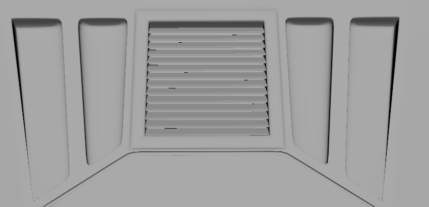
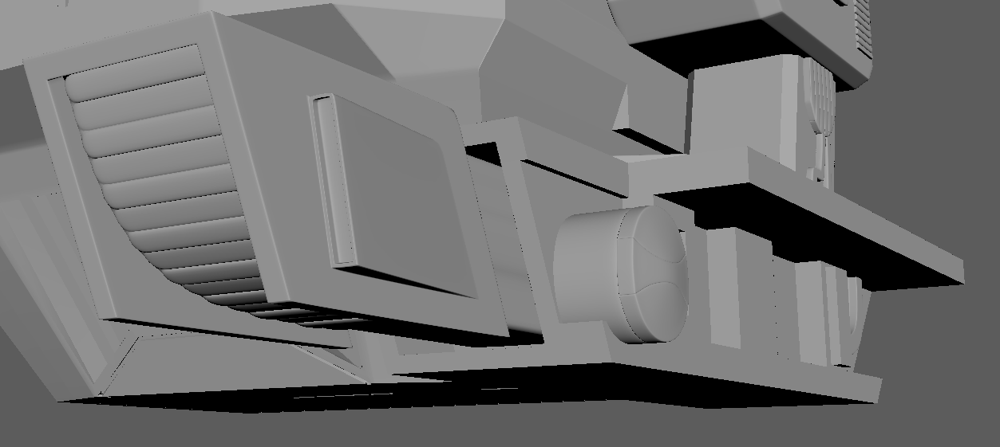
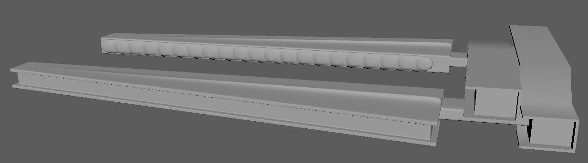

# 飞行器模型

[TOC]

-----

## 整体模型

----

## 主体

### 1.主体原型 | MainBodyPrototype

### 2.顶部组件  | TopComponent

### 3.风挡 | Windshield

### 4.前保险杠 | FrontBumper

### 5.通风窗 | VentilationWindow

#### 前通风窗

#### 前通风盖板

#### 后通风窗

#### 后部组件

### 6.引擎 | Engine

### 7.前控制面板 | FrontControlPanel

### 8.平滑 | Smoothing

#### 添加循环边

#### 添加折痕

-----

## 机械臂

### 1.前臂 | FroeArm

### 2.前臂连接器 | FrontConnector

### 3.后臂 | HindArm

### 4.下臂连接器 | LowerConnector

### 5.下臂 | LowerArm

### 6.钳子 | Pliers

### 7.钳子基座 | PliersPedestal

### 8.钳子管索 | PliersTube

