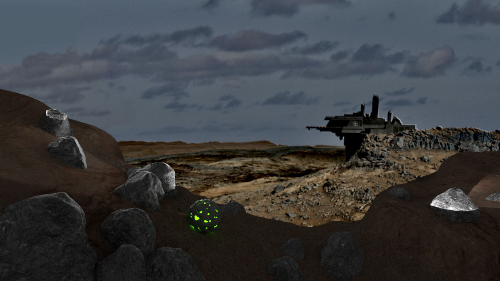
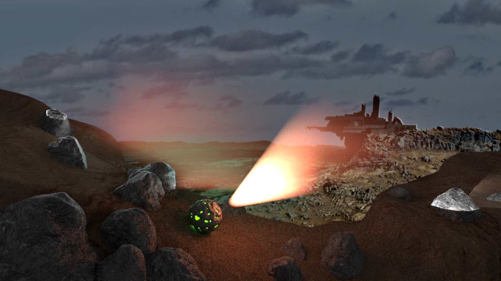

# 灯光 & 渲染

Table of Contents
=================

   * [灯光 &amp; 渲染](#灯光--渲染)
     * [渲染练习](#渲染练习)
     * [飞行器渲染效果](#飞行器渲染效果)
       * [只有天光](#只有天光)
       * [8束光照明系统](#8束光照明系统)
       * [粒子感](#粒子感)

------

## 渲染练习

------

## 飞行器渲染效果

### 只有天光

108帧

------

### 8束光照明系统

初始帧

88帧

108帧

153帧

176帧

------

### 粒子感

89帧

109帧

149帧

