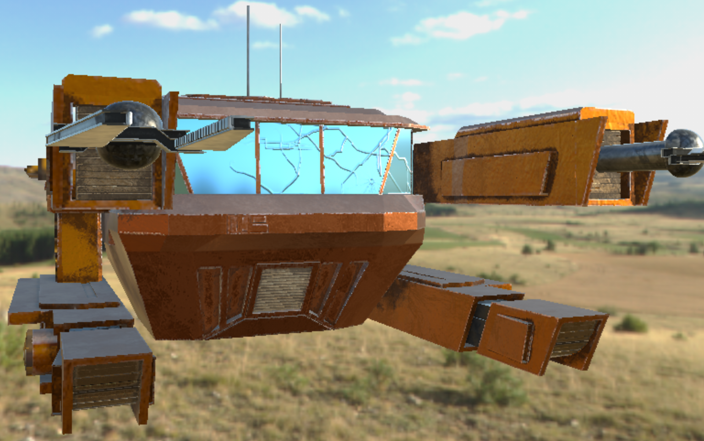
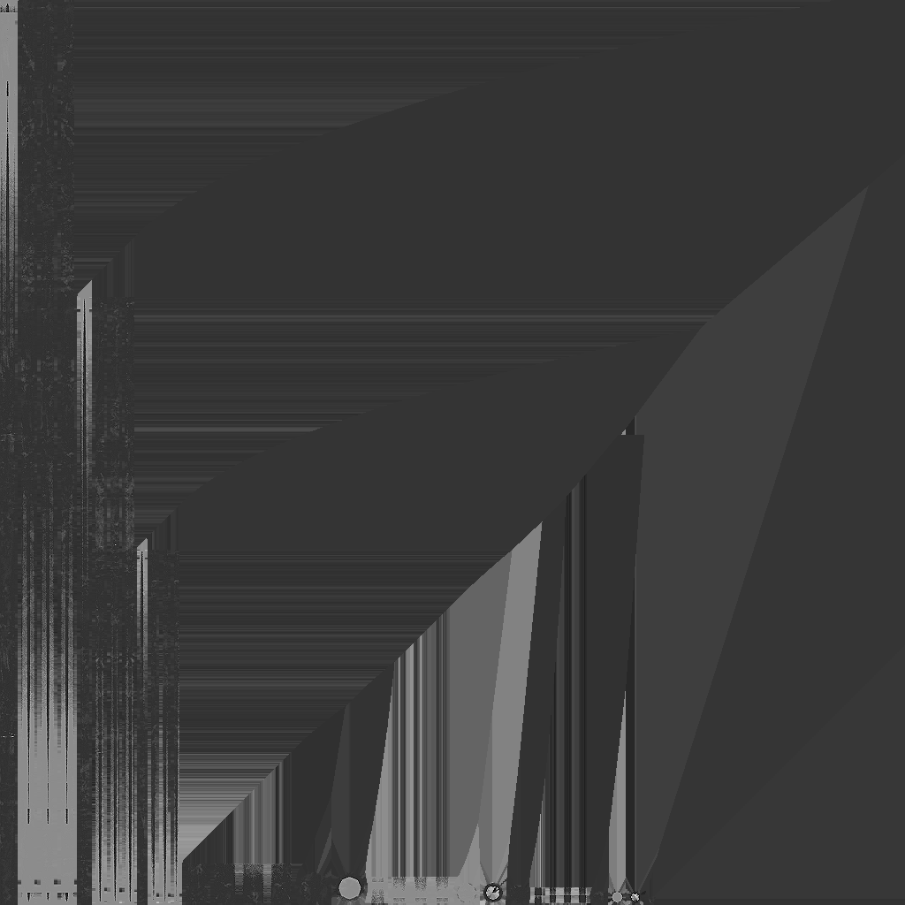
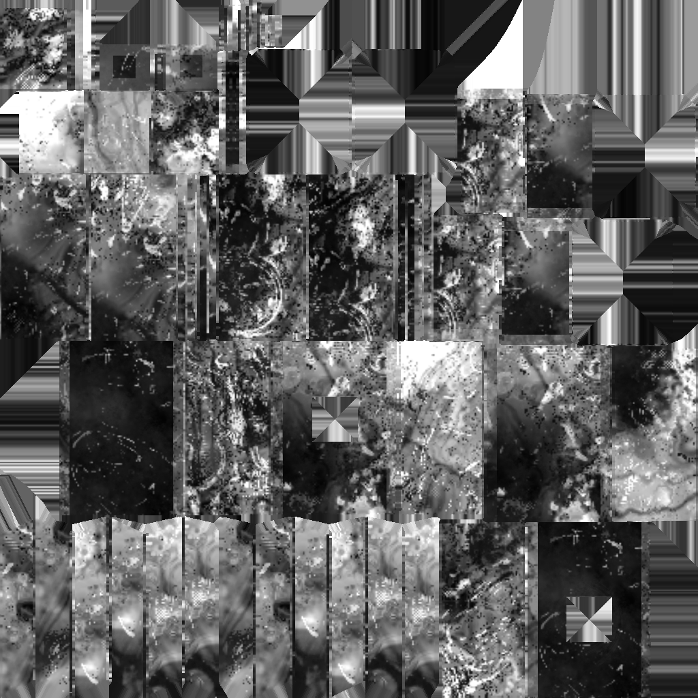
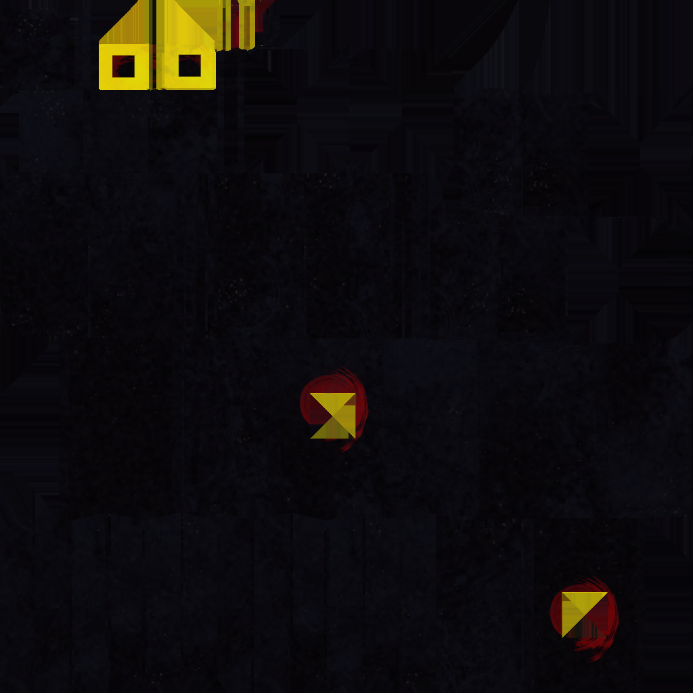
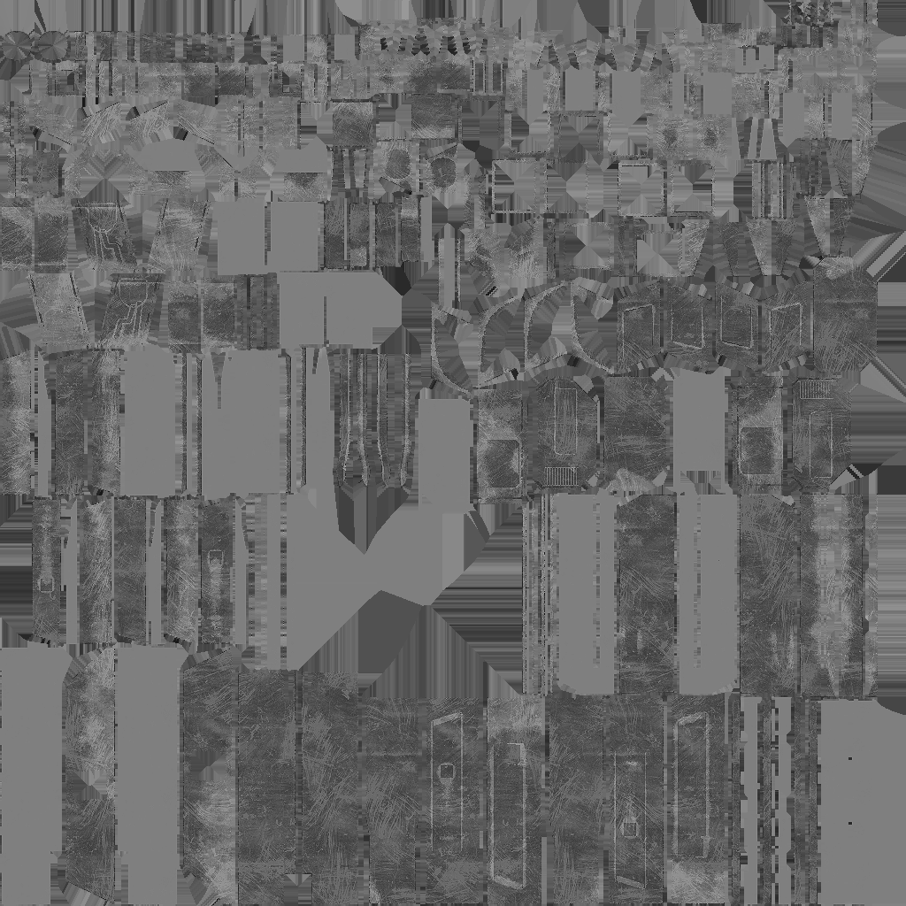
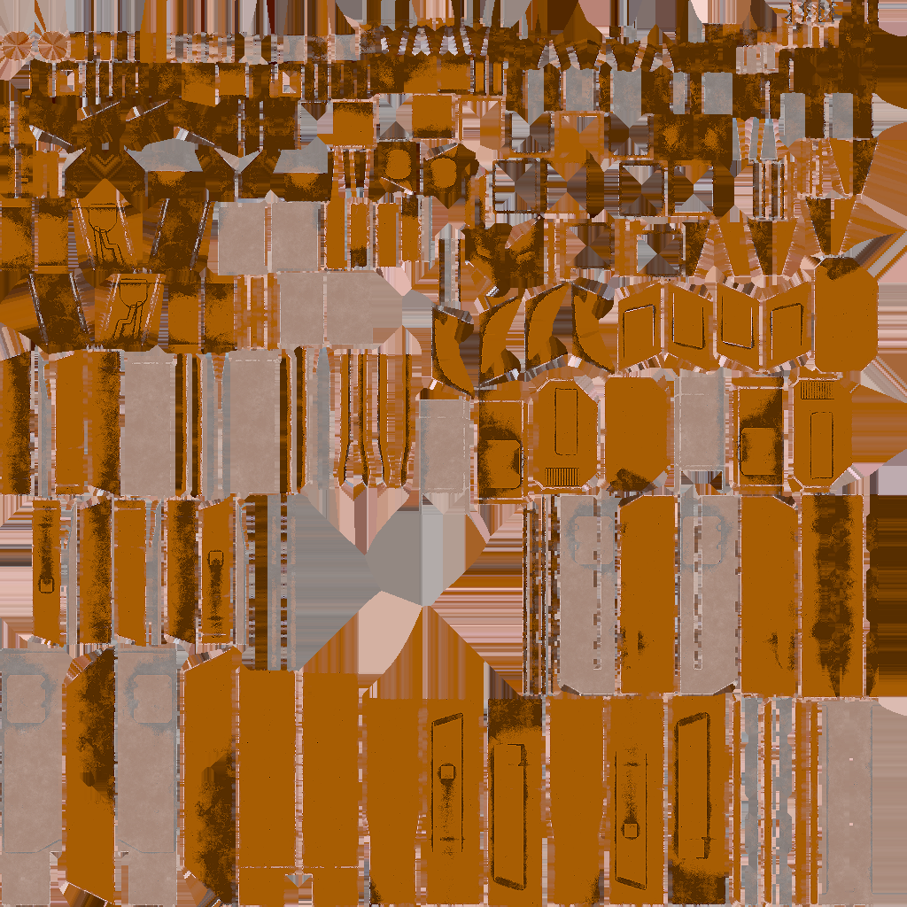
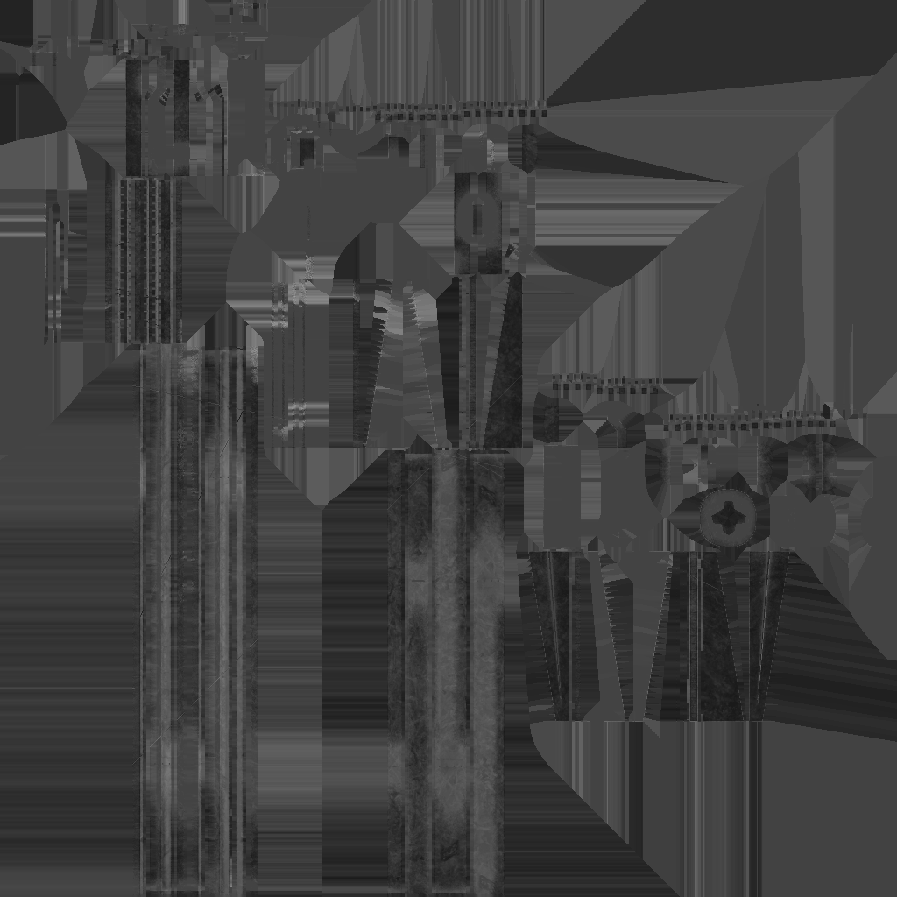
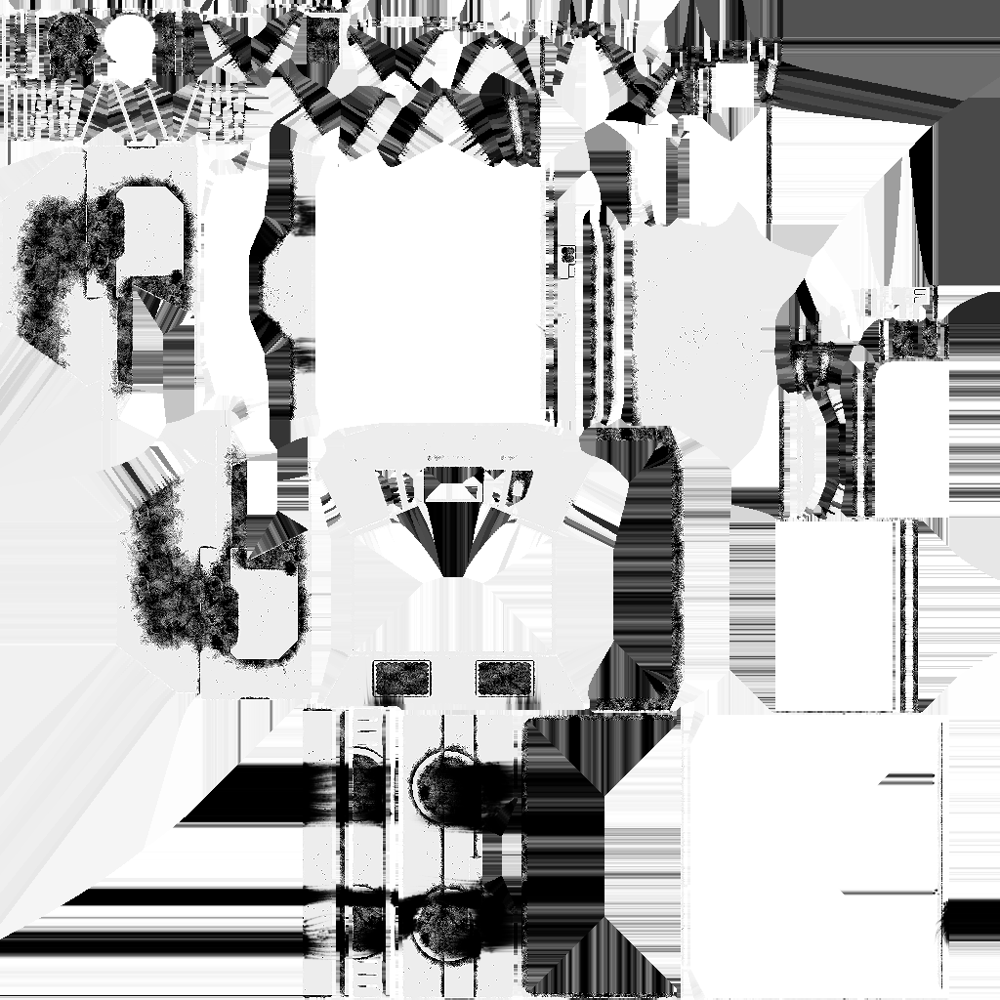
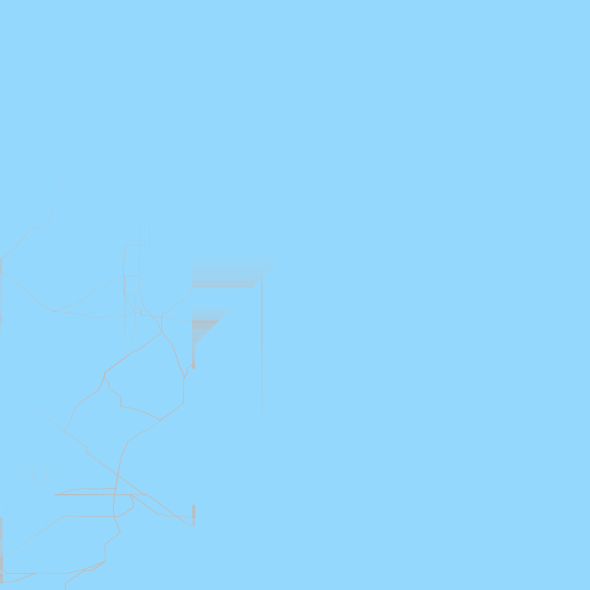
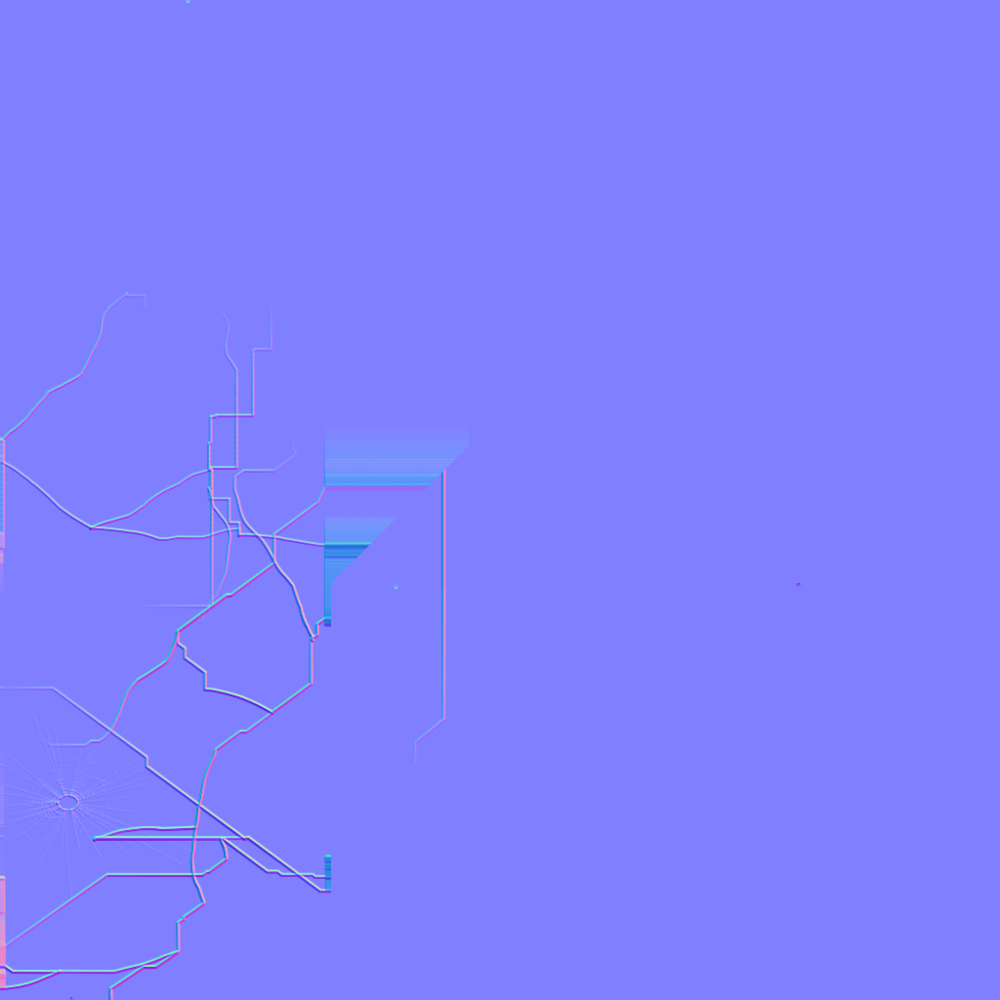

# 纹理材质

Table of Contents
=================

   * [纹理材质](#纹理材质)
     * [效果整体图](#效果整体图)
     * [纹理图](#纹理图)
       * [Antenna](#antenna)
       * [Arm decorate](#arm-decorate)
       * [Arm inner](#arm-inner)
       * [Arm outer](#arm-outer)
       * [Bilnd](#bilnd)
       * [Claw](#claw)
       * [Engine](#engine)
       * [Mainbody](#mainbody)
       * [Window screen](#window-screen)

-----

## 效果整体图

-----

## 纹理图

### Antenna

### Arm decorate

### Arm inner

### Arm outer

### Bilnd

### Claw

### Engine

### Mainbody

### Window screen

